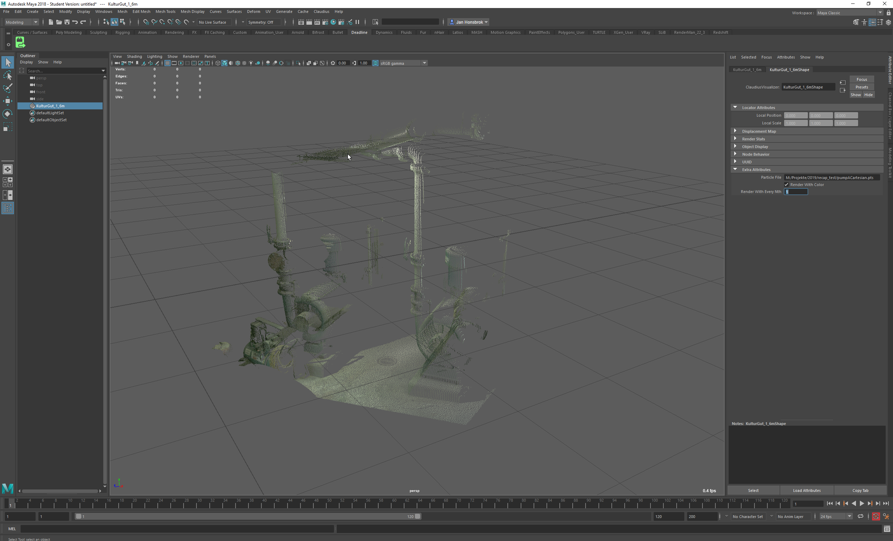

# claudius [](http://www.vfxplatform.com/)

Plugin for Maya and Arnold to display and render Point Clouds produced by 3D Laser Scanners.

Consists of:
- a Maya Plugin with a FileTranslator and a custom Maya Node
- an Arnold Procedural to render the Point Cloud with Arnold
- an MtoA Extension, to translate the custom Maya Node to the Arnold Procedural
## How to build
Prebuild binaries are avaible from the Releases section
Currently only Windows is supported.

### Prerequisites
Non-optional dependencies:
- Maya Devkit
- Arnold SDK
- MtoA Installation (already comes with headers and libs)

Locations of Arnold SDK and MtoA Installation are provided using the Environment Variables `MTOA_LOCATION` and `ARNOLD_HOME`

### Build
Standart Cmake out-of-source build
```shell
mkdir build
cd build
call "C:\Program Files (x86)\Microsoft Visual Studio 14.0\VC\vcvarsall.bat" x64
cmake -G "Visual Studio 14 2015 Win64" ..
cmake --build . --config Release
```
## How to run Maya with Claudius
The build procuces a Zip-Archive containing a Maya Module. The prebuild binaries are the same Zip-Archive.
When you extract the Zip-File, you get the Maya Module. You have two options:
1. Add the folder containing the `claudius.mod` file to your %MAYA_MODULE_PATH% (for example in your Maya.env) and launch Maya regulary
2. Use the `launch_maya_with_claudius.bat`, which will take care of temporaly setting the %MAYA_MODULE_PATH% and launches Maya

## Claudius in action

### Viewport
When you loaded the Claudius Plugin, you can import a Point Cloud file using File -> Import. 
You can select the Claudius Node in the Outliner (Viewport selection does not work), you get additional options.
You can change the file path, display the Point Cloud with color and render only a subset of the particles in the Viewport
### Rendering with Arnold
Just select Arnold as the current renderer and hit render.
The `Render with Color` option is translated to Arnold, the `Render with every Nth` option not.

## Detailed documentation
[here]("./docs/Claudius_Dokumentation_(German).pdf") (German only)


 
